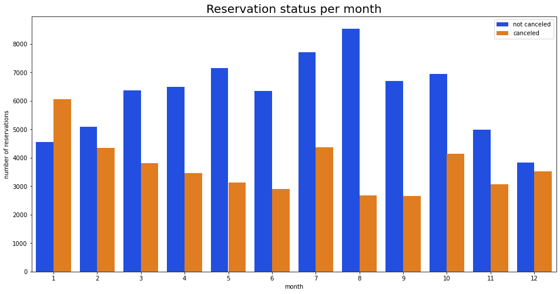

# Data Analyst Portfolio

# [Project 1- Personal Finance (Power BI Dashboard)](https://github.com/ShahadatShoyshob/Project_Personal_Finance)

This Project is based on a person’s personal financial investments and savings. The goal of this project is to find the person’s Investment and savings over 3 years. In order to make the Visualization new savings, income and expenses measures were created for the purpose of using them to make the graphs. The Dashboard consist of bar charts, a trend chart and a table sheet to have the full details of all the spending and savings. There is also a tooltip included for all items listed on the bar chart.

## Financial Dashboard 

# [Project 2- Covid Infection rate 2020-2021](https://github.com/ShahadatShoyshob/Project_Covid_Infection_rate_2020-2021)

•	Extracted the Data from the official COVID-19 infection rate website.
•	SQL queries were used for Data exploration and then to make columns for the Percentage of Death and Infection rate.
•	In Tableau, the visualization data is taken from SQL queries.
•	Tableau visualizes the Infection and Death percentage worldwide

### Tableau visualization link: https://public.tableau.com/views/CovidInfectionrateProject2020-2021/Dashboard1?:language=en-US&:display_count=n&:origin=viz_share_link

# [Project 3: Hotel Booking](https://github.com/ShahadatShoyshob/Project_Hotel_Booking)

The Data was taken from Kaggle. 
I.	The Data was first cleaned and null values were removed by using the Pandas library.  
II.	Then used Seaborn library to visualize cancelled and non-cancellation percentage locations from the data. 
III.	There is also a Data Analyst report I made based on the Visualization facts found in the Hotel Booking data.
